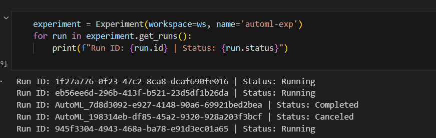
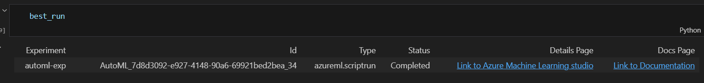
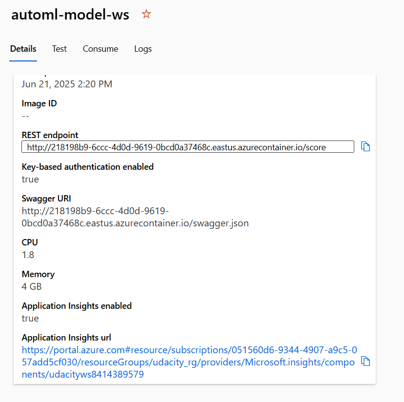
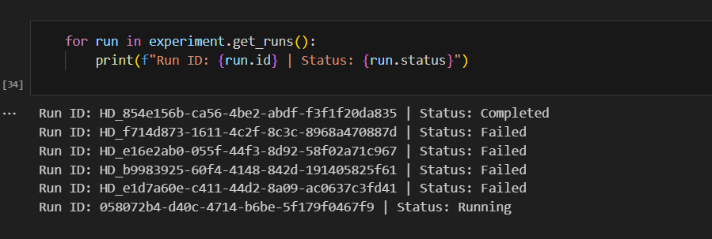
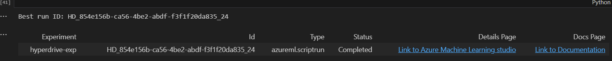
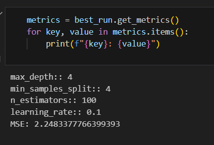

# Machine Learning with Azure - Capstone Project

## Project Overview

This project demonstrates the process of training, evaluating, and deploying machine learning models using Azure Machine Learning services. Two primary methods are explored for model training and optimization: Azure Automated ML (AutoML) and Azure HyperDrive for hyperparameter tuning. The best model is then deployed as a web service.

## Dataset

This project utilizes the **Denver Consumer Price Index (CPI)** dataset, sourced from Kaggle. The dataset contains data about the Consumer Price Index in Denver. 

It can be found at https://www.kaggle.com/datasets/bls/denver-cpi

The primary task is a regression problem: to predict the `cpi` value based on the other features in the dataset. The data is accessed by downloading it using `KaggleHub` library from kaggle, then cleaning it and registering it as a Tabular Dataset in the Azure ML Workspace for use in experiments.

## AutoML

Azure's Automated ML (AutoML) was used to automatically discover the best machine learning model and its corresponding hyperparameters for the CPI prediction task. AutoML iterates through a variety of algorithms and feature engineering steps to find the optimal pipeline without extensive manual intervention. The goal was to find a regression model that minimizes the prediction error.

The AutoML run was configured with the following settings:
- **Experiment Timeout:** Set to 30 minutes to control costs.
- **Primary Metric:** `normalized_root_mean_squared_error` was chosen to evaluate model performance. The goal is to minimize this metric.
- **Task:** Regression.
- **Cross Validation:** set to 3.

The best model found by AutoML was a `VotingEnsemble` which combines the predictions of multiple models to improve overall accuracy and robustness.
- **median_absolute_error:** 0.14.
- **explained_variance:** 0.99.
- **r2_score:** 0.99.


## Hyperdrive

HyperDrive was used to perform a more focused hyperparameter tuning process on a specific algorithm: the `GradientBoostingRegressor` from scikit-learn. This approach allows for fine-tuning a chosen model to achieve optimal performance.

The HyperDrive experiment was configured as follows:
- **Model:** `GradientBoostingRegressor`
- **Parameter Sampler:** `RandomParameterSampling` was used to efficiently search the hyperparameter space.
- **Hyperparameter Space:**
    - `n_estimators`: `choice(25, 50, 75, 100)`
    - `max_depth`: `choice(2, 3, 4)`
    - `min_samples_split`: `choice(3, 4, 5)`
    - `learning_rate`: `choice(0.1, 0.01)`
- **Termination Policy:** A `BanditPolicy` was configured with an `evaluation_interval` of 2 and a `slack_factor` of 0.1. This policy terminates runs that are not performing as well as the top-performing runs, saving compute resources.
- **Primary Metric:** `MSE` (Mean Squared Error), with a goal to `MINIMIZE`.
- **Compute Target:** A pre-configured `AmlCompute` cluster.

The best run from the HyperDrive experiment achieved an MSE of **2.248** with the following optimized parameters:
- **n_estimators:** 100
- **max_depth:** 4
- **min_samples_split:** 4
- **learning_rate:** 0.1

## AutoML vs Hyperdrive

- **AutoML** provides a broad, automated search across different model types and preprocessing pipelines. It's excellent for quickly establishing a strong baseline model with minimal configuration. The best model it produced was a `VotingEnsemble`.

- **HyperDrive** offers a targeted approach to optimize a specific, pre-selected model (`GradientBoostingRegressor` in this case). It gives the user more control over the search space and algorithm.

For this particular problem, the model produced by the `AutoML` run was selected for deployment.

## Deployment

The best model from the HyperDrive run was registered in the Azure ML Model Registry. From the registry, the model was deployed as a web service.

The deployment process involved:
1.  **Registering the Model:** The trained model from the best HyperDrive run was saved and registered in the workspace.
2.  **Creating an Entry Script:** A `score.py` script was created to load the model and define how to process incoming requests and make predictions.
3.  **Defining an Environment:** A conda environment (`sk_dep.yaml`) was specified, listing all necessary dependencies like scikit-learn and azureml-defaults.
4.  **Deploying to Web Service:** The model was deployed to Azure Container Instances (ACI) as a REST endpoint. This endpoint can be queried with new data to get real-time CPI predictions.

To query the endpoint, a POST request with a JSON payload containing the feature data is sent to the service's scoring URI ('http://218198b9-6ccc-4d0d-9619-0bcd0a37468c.eastus.azurecontainer.io/score'). Since authentication is enabled, a primary key is now required. 


```
data = {
  "Inputs": {
    "data": [
      {
        "stateFips": 0,
        "area": 0,
        "areaType": 0,
        "period": 0,
        "periodYear": 0,
        "periodType": 0,
        "type": 0,
        "source": 0,
        "percentChangeYear": 0,
        "percentChangeMonth": 0,
        "ptd_Annual": 0,
        "ptd_Monthly": 0,
        "ptd_Semi-Annual": 0,
        "dr_CO": 0,
        "dr_US": 0,
        "an_Denver/Boulder/Greeley": 0,
        "an_United States": 0
      }
    ]
  },
  "GlobalParameters": 1
}

headers = {'Content-Type':'application/json', 'Accept': 'application/json', 'Authorization':('Bearer '+ api_key)}   
```


## Appendix (images)

<br>
Run details showing successfully completed AutoML experiment.


<br>
AutoML Best run showing the best run ID with status completed and link to the model.

<br>
AutoML endpoint showing as active.


Run details showing successfully completed Hyperdrive experiment.

<br>
Hyperdrive Best run showing the best run ID with status completed and link to the model.

<br>
Metrics of hyperdrive Best run.


## Screencast


## Future Improvement

- **Deploy to AKS:** For a production-ready solution, the model could be deployed to Azure Kubernetes Service (AKS) instead of ACI to handle higher traffic loads and provide better scalability and security.
- **MLOps Pipeline:** Implement a full MLOps pipeline using Azure Pipelines or GitHub Actions to automate the retraining, evaluation, and redeployment of the model whenever new data becomes available.
- **Data Drift Monitoring:** Set up data drift monitoring on the deployed model to detect if the incoming data distribution changes over time, which would trigger a retraining pipeline.
- **Advanced Hyperparameter Tuning:** Explore more advanced sampling methods like Bayesian Sampling in HyperDrive for a potentially more efficient search of the hyperparameter space.